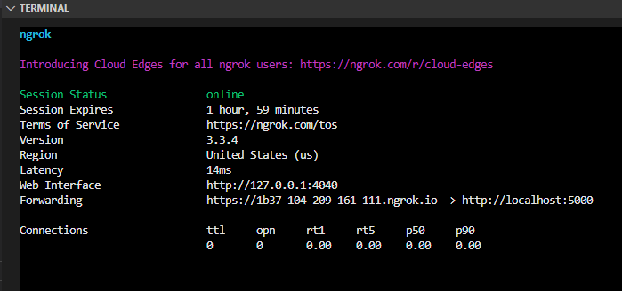
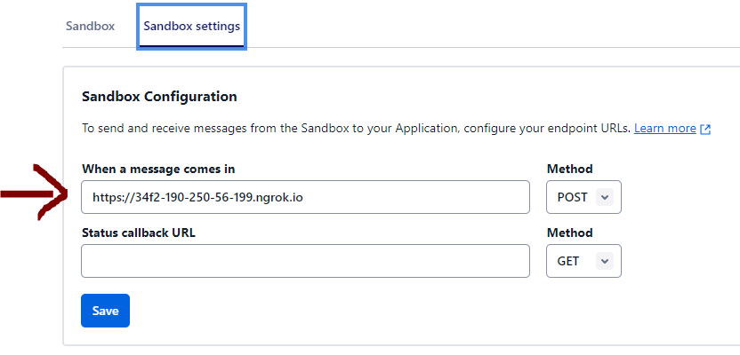

# **Inventory Bot**

#### VIDEO DEMO: https://youtu.be/4z9KNDoWSYs

#### Description:

## Harvard's CS50 final project

## Table of Contents

1. [Introduction](#intro)

2. [Project Structure](#structure)
    - Web Scraping
    - Database
    - Whatsapp bot

3. [Installation](#installation)

4. [Usage](#usage)

5. [Demo](#demo)

<a name="intro"></a>
## Introduction

### Background

This project was developed as a final requirement for Harvard University's CS50 Course. The primary objective of this project is to create a tool or program that addresses a real-life problem or enhances an existing real-life process within a company, institution, or personal context.

I have chosen to develop a tool aimed at improving the efficiency of an internal process within the company where I am employed. Specifically, I work as a Product Genius at a BMW car dealership in Colombia. In this role, my responsibilities involve an in-depth understanding of our products and their functionalities, conducting training sessions for the sales team, engaging with customers, and various other duties.

### Project goal

This project is all about making life easier for our sales team when they check our car inventory every day. Our company has this handy web app that shows all the cars we've got in stock across the nation. Our sales reps use it daily for various reasons. Sometimes, they're just browsing to see what's available for our customers, and other times, they need to quickly check if we've got a car in the showroom with the exact interior color a customer wants.

Checking our inventory is a breeze when you're using a computer browser, although it can be a tad slow at times. But the real challenge kicks in when you attempt to do it from a mobile phone because our web app isn't quite mobile-friendly. 

To solve this, I decided to build a WhatsApp bot that can instantly answer questions about the car inventory in real time. This bot will be integrated into the smartphone app that our sales team uses the most. Since our sales team practically lives on WhatsApp chatting with customers, I thought, 'Why not bring the inventory right to their fingertips?'

<a name="structure"></a>
## Project Structure

**1. Web Scraping:**

The initial step in building the bot is to obtain real-time access to inventory data. Initially, the logical approach would involve speaking with the company to request access to their database — a step that will be pursued in the future. However, for the time being, as I intend to develop this independently without the company's assistance, I have opted to access inventory data through web scraping. This should be feasible, as the inventory is accessible both to the sales team and to me through a browser-based app.

For web scraping, I'm using the Selenium library, which lets me simulate a real user browsing a web page. I've implemented this in a Python script called *'inventory_search.py.'* So, what this code does is it automatically opens up a Chrome browser, logs into my inventory account, navigates to a page displaying the entire car inventory, and then starts sifting through the car details one by one. It extracts the relevant information that'll come in handy for our chat bot, and stores them initially in a list of dictionaries.

**2. Database:**

After collecting all the inventory data, I made the decision to store this information in an SQLite3 database. This choice seems suitable since there will be only one writer accessing the database, and the number of readers won't exceed 100.

The database will be saved in a file named *'car_inventory.db,'* and the writing process to this database is also handled within the *'inventory_search.py'* script, specifically in the *'create_database'* function. Additionally, this script generates a CSV file containing the entire inventory, though it is currently not utilized for any specific purpose. Its intent is to potentially facilitate future iterations of the project.

**3. Whatsapp-bot:**

For the WhatsApp bot, I've employed the assistance of the *Twilio* library, which simplifies the process of connecting to WhatsApp, monitoring incoming user messages, and delivering responses. To establish the connection and facilitate communication with the Twilio service, I've also integrated the Flask framework. All of these components are neatly packaged within the *'whatsapp-bot/bot.py'* script.

It's important to note that, at present, I'm using Twilio's 'Twilio Sandbox' testing service. This service permits me to test the bot with a single WhatsApp number at no cost. However, it's worth mentioning that for a future real-world deployment of the project, there will be associated Twilio fees for scaling up the usage of their service.

<a name="installation"></a>
## Installation

1. Run the command `pip3 install cs50` to install CS50 library.This will install the SQL and Flask modules needed for the database and the whatsapp bot.

2. Run the command `pip3 install selenium` to install Selenium library to enable web scraping
 

3. Install google-chrome browser (Ubuntu):

    Update de local package manager:
        
        sudo apt update
        
        

    Upgrade the packages to the new version:
    
        sudo apt upgrade
    
    
    Use the wget command to download the latest package version of Chrome:

        wget https://dl.google.com/linux/direct/google-chrome-stable_current_amd64.deb
    

    Use the dpkg Linux tool to install Chrome from the downloaded package:

        sudo dpkg -i google-chrome-stable_current_amd64.deb
    
    In case we encounter any errors during the installation process, we’d need to run this command to fix them:

        sudo apt-get install -f
        
    
    Finally, we can check if the installation was succesful by runnign this command:

        google-chrome --version
        
    This should output the google-chrome version that we just installed.

4. Run command `pip install twilio` to install Twilio library, this will enable the creation of the whatsapp-bot.

5. Set up a new Twilio account:

    - Go to [Twilio's Website](https://www.twilio.com/) and create a new account.

    - After login, select the Develop option from the left menu and then further select the Messaging subject then select the Try it out option, and in the last click on Send a WhatsApp message. This will open up a new webpage for setting up the WhatsApp Sandbox.

        

    - Configure the Twilio WhatsApp Sandbox by sending a message to this WhatsApp number with the secret unique security code as shown in the below images:

        Send the code as below format to the following number: +14155238886

        secret code : join <secret-code>

        

        Now, send the secret code to the above WhatsApp message and you will receive a confirmation message

6. Run the following command to install ngrok, a tool that will enable us to connect the whatsapp bot to the internet.

    ``` 
     curl -s https://ngrok-agent.s3.amazonaws.com/ngrok.asc | sudo tee /etc/apt/trusted.gpg.d/ngrok.asc >/dev/null && echo "deb https://ngrok-agent.s3.amazonaws.com buster main" | sudo tee /etc/apt/sources.list.d/ngrok.list && sudo apt update && sudo apt install ngrok
    ```

<a name="usage"></a>
## Usage

### To Begin: Running the 'inventory_search.py' Script

In order to retrieve the car inventory, the *'inventory_search.py'* script is your first step. This script handles web scraping to obtain the current car inventory data. It's important to note that at this stage, the code will update the database only when you manually execute it. The script is not set to run automatically at the moment, which is a behavior we would expect to keep our inventory database updated.

The reason behind this design choice is our anticipation of a forthcoming project phase where the company will become involved. During this phase, an alternative method for accessing the car inventory, without the need for web scraping, is expected to be implemented. This evolution will eliminate the requirement for manual updates and ensure that the database remains consistently up to date.

### Configuring Credentials for Secure Access

For the proper execution of this code, it is essential to provide the necessary credentials for the company's inventory app. To safeguard privacy and security, this is accomplished using environment variables. Before running the code, follow these steps in your command line:

1. Use the export command to set the environment variable for the employee's username:

```
export BMW_USERNAME=<employee_username>
```

2. Similarly, set the environment variable for the employee's password:

```
export BMW_PASSWORD=<employee_password>
```

By configuring these environment variables in this manner, we ensure that sensitive information is kept secure while allowing the code to access the required credentials for operation.

### Accessing Code Functionality and Database

For security reasons, the company's credentials cannot be shared openly. Instead, you'll find a video demonstration of this script's capabilities in the [Demo](#demo) section, showcasing its functionality.

It's important to note that the script generates an important output: the 'car_inventory.db' file. To ensure you have access to this vital resource, we've included the database file within the project contents. Even if you encounter difficulty running the 'inventory_search.py' script due to credential restrictions, you can still utilize the 'car_inventory.db' database file to enable proper functionality for the WhatsApp bot.

### Running whatsapp bot

Before running the 'whatsapp-bot/bot.py' script, it's essential to provide your own Twilio credentials. For security and privacy reasons, this is achieved through the use of environment variables.

Here are the steps to follow:

1. First, log in to your Twilio account and navigate to the 'Console' section. There, you can locate your 'Account SID' and your 'Authentication token.'

2. Copy both your 'Account SID' and 'Authentication token.'

3. Now, execute the following commands:

```
export TWILIO_ACCOUNT_SID=<your_account_SID>
export TWILIO_AUTH_TOKEN=<your_auth_token>
```
Replace '<Your_Account_SID>' and '<Your_Authentication_Token>' with your actual Twilio credentials.

Now we can safely run the *'whastapp-bot/bot.py'* code.

### To Enable Bot Functionality: Exposing the Application and Connecting to Twilio

To ensure the proper functioning of our bot, we need to make our running application accessible via the internet and establish a connection with our Twilio account. To accomplish this, we'll utilize the 'ngrok' tool.

1. Open a new terminal and execute the following command:

```
ngrok http 5000
```

You should see an output similar to this:



2. Copy the forwarding address provided.

3. Access your Twilio sandbox settings and paste the copied forwarding address into the 'When a message comes in' field, as illustrated below:



4. Save your settings.

These steps will enable the bot to operate.

### Using the whatsapp bot.

Now, you can open your WhatsApp app with the phone number you have registered with Twilio. Send a message to the Twilio sandbox number: +14155238886. The message should contain the name of a car model (e.g., 'X4' or '320i'). The bot will respond with information about the number of cars available and their details for that specific model in the inventory.

Alternatively, you can send the word 'stock,' and the bot will provide you with the total car stock available in the inventory.


**Important Note:** Running the code as described in this document allows you to test its functionality using a single WhatsApp number. To expand the project's reach and launch it as a fully functional tool for our sales team, certain operational costs will be incurred.

I am currently preparing to present this project as an innovation initiative within our company in the coming weeks. For future iterations of the project, I intend to collaborate with the company, leveraging both assistance and budget resources, to expedite the deployment of this application. This will enable the sales team across the country to fully benefit from its capabilities.

<a name="demo"></a>
## Demo

### Watch the Video: Web Scraping in Action with 'inventory_search.py'

In the video below, you can witness the web scraping process in action while the 'inventory_search.py' code is executed.

[Web scraping demo video](media/web%20scraping%20demo%20video.mp4)

### Watch the Video: Using the WhatsApp Bot for Inventory Inquiries

The video below provides a comprehensive demonstration of a user interacting with the WhatsApp bot. It showcases how users can inquire about the availability of specific car models or request an inventory overview.

[Whatsapp-bot demo video](media/Whatsapp-bot%20demo%20video.mp4)
